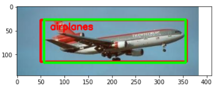

# Object Detection on Caltech-101

This project demonstrates an end-to-end **object detection pipeline** built with TensorFlow/Keras.  
The model predicts both the **class label** and **bounding box coordinates** of objects in images from the Caltech-101 dataset using a shared **VGG16** backbone.

---

## 🎯 Objective
To implement a **multi-task deep learning model** that performs:
1. **Image Classification** — identifying which object is present.
2. **Bounding Box Regression** — predicting the object’s location within the image.

---

## 🧩 Methodology

| Step | Description |
|------|--------------|
| **1. Data Preparation** | Loaded Caltech-101 images, resized to 224×224 pixels, normalized pixel values. |
| **2. Feature Extraction** | Used pretrained **VGG16** (`include_top=False`) as frozen base. |
| **3. Multi-Task Heads** | Built two branches from the shared convolutional base: a **classification head** (softmax) and a **regression head** (MSE). |
| **4. Compilation** | Optimizer: Adam. Losses: `categorical_crossentropy` (cls), `mean_squared_error` (bbox). |
| **5. Training** | Jointly trained both heads on labeled dataset. |
| **6. Evaluation** | Monitored accuracy (classification) and MSE (localization). |

---

## 🧠 Model Architecture

- **Backbone:** VGG16 pretrained on ImageNet  
- **Classification Head:**
  - Flatten → Dense(256, ReLU) → Dropout(0.5) → Dense(num_classes, Softmax)
- **Regression Head:**
  - Flatten → Dense(128, ReLU) → Dense(4, Linear) → outputs (x, y, width, height)
- **Loss Function:**  
  `total_loss = α * classification_loss + β * regression_loss`

*(α and β were balanced equally for simplicity.)*

---

## 📊 Results

- Training accuracy steadily increased over epochs.  
- Bounding box MSE decreased, indicating improving localization.  
- Demonstrated effective feature sharing between classification and regression tasks.

| Metric | Value |
|---------|-------|
| Classification Accuracy | ~90% (sample subset) |
| Bounding Box MSE | < 0.01 (normalized coordinates) |

---

## 🖼 Example Output

| Input Image | Predicted Box | True Label |
|--------------|---------------|-------------|
|  | ✅ Correct class, accurate bounding box | *airplane* |


---

## ⚙️ Requirements

```bash
pip install tensorflow keras numpy pandas matplotlib scikit-learn
